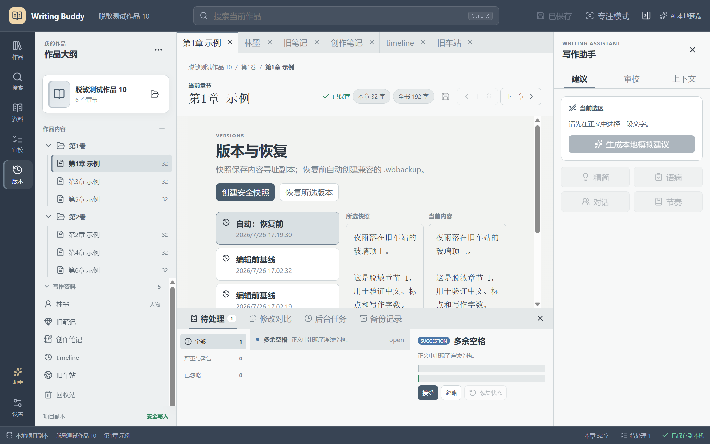

# 002 — Desktop acceptance, 2026-07-26

## Outcome

The automated migration gates and the copied-project desktop workflow passed.
The Next client opens, edits, reviews, versions, backs up and restores the
sanitized Legacy schema through real Tauri IPC. Legacy remained read-only.

The production build has no WebView remote-debugging argument. Diagnostic
remote debugging is isolated to `scripts/diagnostics/tauri.webview-debug.conf.json`
and is not merged into the production configuration.

## Environment

- Windows, `x86_64`
- Node.js `24.14.0`
- pnpm `10.32.1`
- Tauri `2.11.4`
- Rust tests executed with `CARGO_BUILD_JOBS=1`
- Sanitized project copy:
  `tmp/desktop-acceptance-run-20260726`

## Automated gates

| Gate | Result |
| --- | --- |
| ESLint | Passed, zero warnings |
| TypeScript | Passed |
| Vitest | 6 files, 13 tests passed |
| Vite production build | Passed |
| Rust | 3 tests passed |
| Compatibility report | 10/10 fixtures passed, 0 blocking |
| Tauri production build | Passed; EXE and NSIS bundle produced |

`eslint.config.mjs` ignores generated `tmp`, `artifacts`, `target`, `dist` and
coverage output so WebView2 profile JavaScript cannot contaminate source lint.

## Desktop workflow evidence

| Scenario | Evidence |
| --- | --- |
| Startup/render | The original white screen was reproduced through CDP. Monaco failed because `freezePrototype: true` made `Object.prototype.toString` read-only. Production now uses `freezePrototype: false`; strict CSP and local-only Tauri content remain. The complete workbench then rendered without a page error. |
| Project open | Opened a copy of sanitized fixture `10-full`: 2 volumes, 6 chapters, 5 resources, 192 words. |
| Chinese save | Appended Chinese text and saved through Rust atomic write. Disk content, hash and UTF-8 encoding were verified. |
| Save state | Added immutable `DocumentSession.copy()` updates. Header, sidebar and total word counts changed together and returned to `已保存`. |
| Restart | Restored project, first chapter, six open tabs, cursor position, scroll state, Versions mode and Fog theme. |
| External conflict | Dirty local text plus a forced disk edit produced the side-by-side conflict dialog. Reload accepted the disk version; explicit overwrite accepted the local version. |
| Line endings/BOM | Real IPC saves preserved LF/no-BOM, CRLF/no-BOM and LF/UTF-8-BOM states on separate fixture copies. |
| Resources | Opened chapter, Markdown note, character, item, timeline and worldbuilding editors. Edited and saved a character, then restored it from a snapshot. |
| Review | Ran local review, accepted a double-space issue, undid it, ignored/restored a suggestion and verified `.writing-buddy/review/issues.json` persistence. Unit coverage also verifies stale-anchor detection. |
| Versions | Created two manual snapshots, inspected chapter differences and restored 15 managed resources. Restore created an automatic pre-restore backup. |
| Backup | Created and inspected a format-v1 `.wbbackup` containing 17 files, changed a chapter on disk, restored all 17 files and verified the change was removed. Restore created an `自动：恢复前` snapshot. |
| AI credential | Stored a non-secret acceptance token in Windows Credential Manager, confirmed provider availability, then removed it and confirmed the credential no longer existed. |
| Themes/focus | Switched Paper, Midnight, Fog and Focus themes, entered/exited focus mode and verified Fog persisted after restart. |
| Process isolation | No Code/Code-OSS or Legacy application process was running against the copied project. Production smoke launch was responsive, opened no remote-debug port, and ended with zero `writing-buddy-next.exe` processes. |

## Negative/security evidence

- Invalid JSON returned `invalidManifest`; the copied manifest SHA-256 stayed
  `9598529c78184073133f6ee8f7ed818686b9ba97bb5a59a62b0c987cdf425167`.
- The `../outside.md` project opened read-only with `unsafePath` and
  `missingChapterFile`; the copied manifest SHA-256 stayed
  `5b226330841e12605743555c954b7f4d231a5d906cc1df167c64cabc9e186bd1`.
- A modified backup payload failed inspection with
  `entryChecksumMismatch`.
- A correctly framed backup containing `../outside.md` failed inspection with
  `unsafeOrDuplicatePath`.
- The valid backup was restored after both destructive-copy tests and passed
  inspection again with 17 entries.
- The only production logging call emits an allow-listed event name, severity,
  a 12-character project token and an optional code. No manuscript field is
  accepted. Repository search found no retained acceptance credential.

## Production artifacts

- EXE:
  `apps/desktop/src-tauri/target/release/writing-buddy-next.exe`
  - 7,510,528 bytes
  - SHA-256:
    `289229faad328872eff38bc4078a737b6809daeb6f96bcf616400034b784d15f`
- NSIS:
  `apps/desktop/src-tauri/target/release/bundle/nsis/Writing Buddy_0.1.0_x64-setup.exe`
  - 3,101,259 bytes
  - SHA-256:
    `7e36c8e824d48531ec8d79cec6a33903c1e6a59fbeb3c5f61b29bfbd15b94544`

## Visual evidence

## Remaining cutover work

- Complete the human M9 gates: 30 writing sessions, 10 close/restart
  recoveries, 3 backup restores, 3 version restores and no critical defects.
- Do not retire Legacy until those human gates are recorded.
