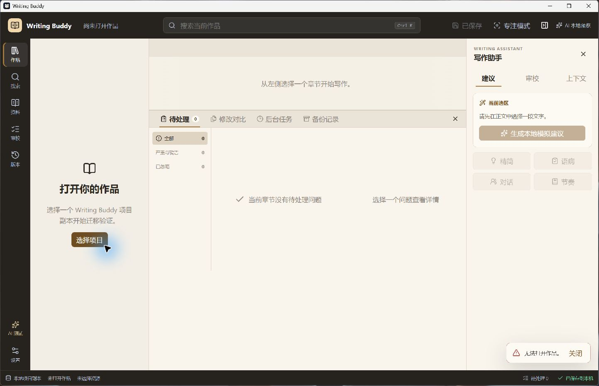

# StoryForge Gate A baseline

Date: 2026-07-27  
Branch: `codex/phase-1.0a-deepseek-ai-foundation`  
Baseline commit: `7e658a284920b0e61d42da39a0addaa39bd6b11d`

## Repository state

The frozen client is a Tauri 2 + React + TypeScript + Rust application. It uses
Zustand mode selection instead of React Router and keeps project open logic
across the current store, bridge, Rust commands, migration reader, safe
filesystem and process-lock modules. The authoritative mapping is
`docs/plans/storyforge-source-map.md`.

## Automated baseline

Commands were run against the baseline with only documentation assets added.

| Command | Exact result |
| --- | --- |
| `pnpm typecheck` | Passed, exit 0 |
| `pnpm lint` | Passed, exit 0, zero warnings |
| `pnpm test` | Passed, 9 files / 27 tests |
| `cargo test --manifest-path apps/desktop/src-tauri/Cargo.toml` | Passed, 15 unit tests / 0 failures; 0 doc tests |

Cargo emitted only the existing MSVC linker library-creation warning.

## Open failure reproduction

The release app was started from:

`apps/desktop/src-tauri/target/release/writing-buddy-next.exe`

On startup the existing Zustand workspace attempted to restore its persisted
recent project. The public UI rendered the no-project shell and only:

```text
无法打开作品。
```

Observed failure surface:

- Public command: `open_project`
- Public stage: not exposed
- Public code: not exposed
- Safe project path: not exposed
- Diagnostic ID: not generated
- Log: the current `project.open` event is emitted only after a successful
  open, so the failure has no correlated diagnostic event
- Retry/read-only/repair/open-directory/diagnostic actions: absent

Root cause of the information loss is deterministic in
`apps/desktop/src/app/store.ts`: Tauri rejects with a serialized string rather
than a JavaScript `Error`, so the catch block replaces the command error with
the generic fallback. The Rust command also returns unstructured strings such
as `manifestNotFound`, `invalidManifest`, `unsupportedSchema` and
`projectLocked:<pid>`.

Screenshot:



## Safe acceptance project

A new validation-only copy was created from the sanitized `10-full` fixture:

```text
tmp/storyforge-gate-a-project-20260727
```

- Chapters: 6
- Initial managed bytes: 7,120
- Manifest SHA-256:
  `BCFF2896E08EDBA5D3E3A6EF76A1EF2F03FE287929737F7E41049E15F521FE96`

The fixture source and all real author projects remain untouched.

## Baseline risks

1. Every open failure collapses to a generic toast.
2. A valid project locked by another process cannot fall back to read-only.
3. The UI cannot distinguish missing manifest, schema failure, integrity
   failure and lock conflict.
4. Startup recovery failure gives no retry or diagnostic path.
5. The current no-project bootstrap automatically opens a native folder picker,
   which makes first launch feel like an error rather than a stable landing
   state.

These are Gate A findings, not Story Kernel requirements.
