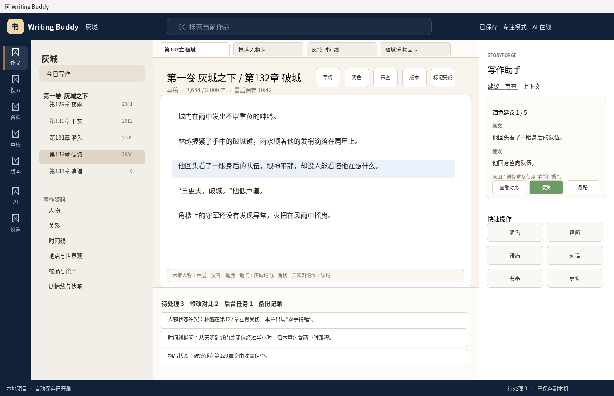
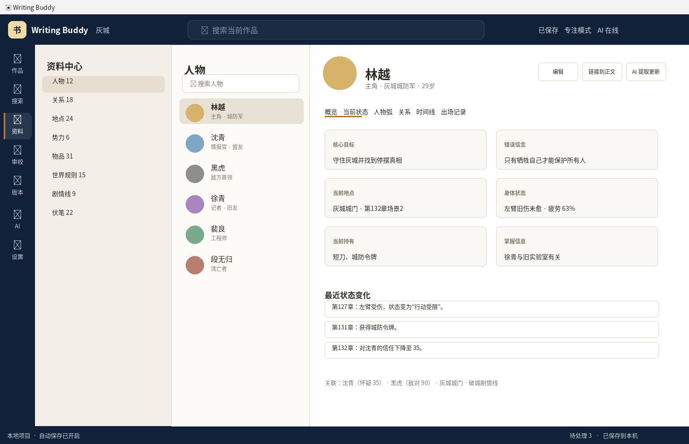
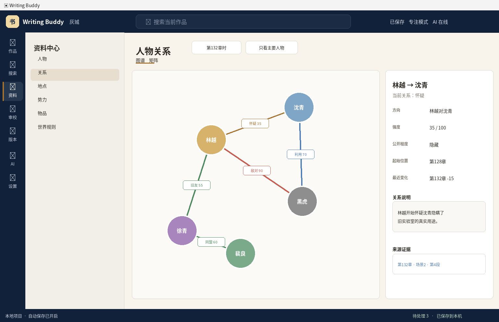
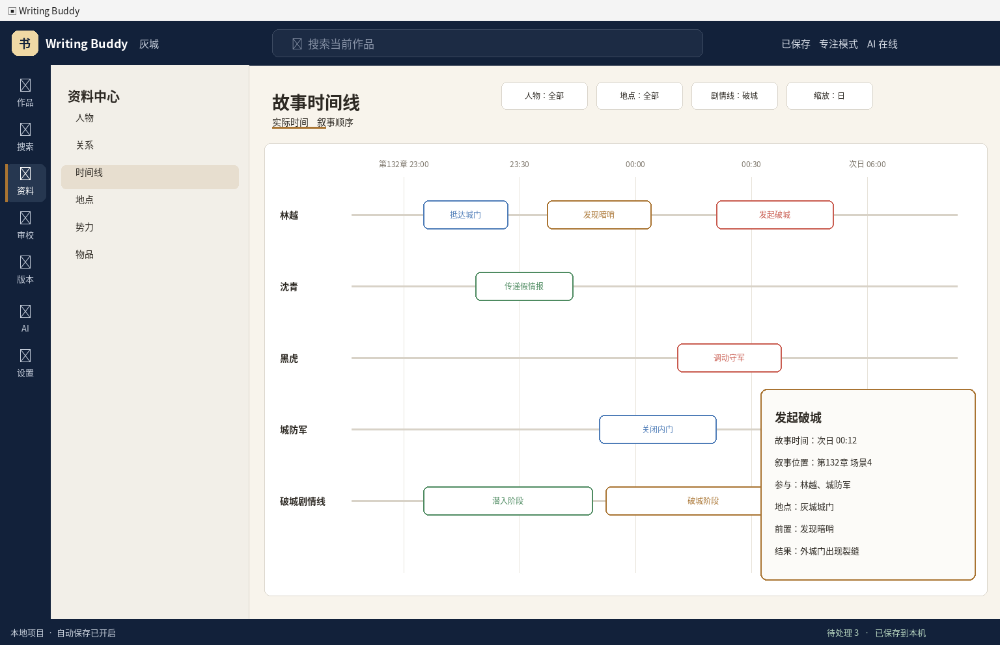
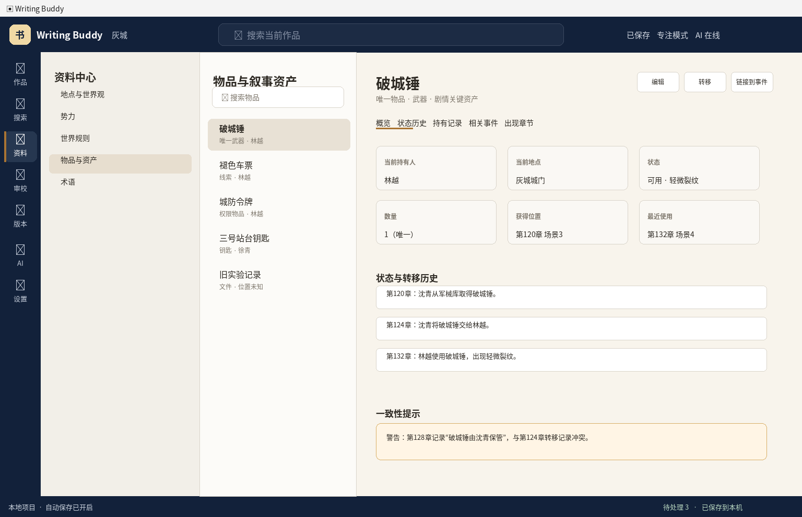
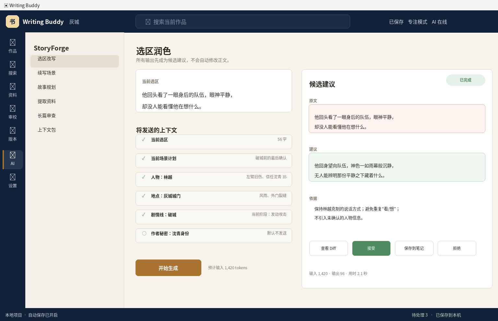

# Writing Buddy StoryForge 专业小说编辑器完整设计方案 v1.0

**文档用途：** 可直接交付 Codex 作为产品、交互、数据和工程设计契约。  
**目标客户端：** 已完成迁移的 Writing Buddy Tauri 桌面客户端。  
**目标阶段：** 从“可用的本地写作工具 + DeepSeek 通道”升级为“专业长篇故事工程系统”。  
**基准窗口：** 1536 × 992，Windows 原生标题栏 32px，WebView 内容区从 `y=32` 开始。  
**日期：** 2026-07-27。

---

## 0. 执行结论

当前客户端的产品外壳、导航、主题、本地审校入口、版本恢复入口与 DeepSeek 流式测试已经具备较高完成度。下一阶段不能继续堆叠互不关联的“人物页、时间线页、物品页”，而应先建立统一 **Story Kernel**：

```text
Manuscript（稿件）
+ Entity（人物、地点、势力、物品、世界规则）
+ Event（事件和时间）
+ Relationship（关系）
+ State（随故事位置变化的状态）
+ Information（真实事实、人物认知、读者认知、作者秘密）
+ Evidence（来源章节、场景、文本范围、版本）
```

所有专业功能都必须从这套内核读取和写入。AI 只能使用作者确认过的 Story Kernel 数据构建上下文，模型输出只能成为候选建议，未经作者确认不得修改正文或正式资料。

### 0.1 推荐阶段

```text
1.1A 作品打开可靠性 + Story Kernel
1.1B 场景模型 + 正文链接
1.2  人物 + 人物状态 + 人物关系
1.3  事件 + 多轨时间线 + 因果关系
1.4  世界观 + 地点 + 势力 + 物品与叙事资产
1.5  剧情线 + 伏笔 + 信息权限
1.6  AI Context Pack + 选区改写
1.7  长篇一致性审查
1.8  仪表盘 + 导出 + 真实作者验收
```

每个阶段必须独立可用、独立测试、独立打标签。禁止一次提交全部系统。

---

# 1. 当前界面评估与 P0 阻断

## 1.1 已完成优势

- 独立 Tauri 产品壳已形成，不再暴露 VS Code/Code-OSS 开发面板。
- 顶部搜索、左侧主导航、作品区、写作助手、底部状态栏的产品语言已经统一。
- 纸页、深夜、薄雾、专注主题已经具备清晰方向。
- 本地审校与 AI 自动审校采用“生成建议，不自动修改”原则。
- DeepSeek 流式测试台已能显示生成结果、停止、复制、清空、输入/输出 Token 和耗时。
- 版本与恢复已有独立页面，符合本地优先产品定位。

## 1.2 当前最高优先级问题

截图中所有页面均出现“无法打开作品”，因此以下功能尚不能进行真实项目验收：

- 章节编辑与保存；
- 人物、世界观、时间线数据落盘；
- 审校定位正文；
- 版本与恢复；
- AI 读取选区和上下文。

### P0 必须完成的作品入口

```text
打开现有作品
新建作品
打开最近作品
打开示例作品
从 Legacy 项目导入
只读打开
修复项目
```

错误弹窗必须提供：

```text
失败阶段
公开错误码
项目路径（可复制，默认隐藏用户名段）
只读打开
查看诊断
打开目录
重试
关闭
```

仅显示“无法打开作品”不符合可诊断性要求。

---

# 2. 产品原则

## 2.1 作者控制权

所有 AI 和自动提取结果遵循：

```text
提议 → 查看来源和影响 → 作者确认 → 正式写入
```

禁止：

- 自动覆盖正文；
- 自动确认人物事实；
- 自动删除或合并资料；
- 默认上传整个项目；
- 把 AI 推测当作故事事实；
- 在后台持续生成章节。

## 2.2 一等资源

以下对象都必须拥有独立 ID、独立 Tab、独立链接和反向链接：

```text
Chapter
Scene
Character
Location
Faction
Item
WorldRule
TimelineEvent
Relationship
PlotThread
Foreshadowing
StoryInformation
ReviewIssue
```

系统页如回收站、设置、版本、审校不得伪装成 Markdown 文件。

## 2.3 来源可追踪

每条正式故事信息至少包含一个 Evidence：

```text
章节/场景/段落范围
资料资源
作者手工录入
确认时间
适用的故事位置
来源版本
```

## 2.4 状态随故事位置变化

人物、关系、物品、地点状态不能只有“当前值”，必须支持历史：

```text
第 12 章之前：林越未受伤
第 12 章之后：左臂受伤
第 20 章之后：伤势恢复
```

## 2.5 实际时间与叙事顺序分离

时间线必须同时管理：

```text
Story Time：故事世界中实际发生顺序
Narrative Order：读者在稿件中看到的顺序
```

---

# 3. 全局 UI 框架

完整机器可读坐标见：`storyforge-ui-layout-spec-v1.json`。

## 3.1 1536 × 992 基准坐标

| 区域 | X | Y | W | H | 规则 |
|---|---:|---:|---:|---:|---|
| Windows 标题栏 | 0 | 0 | 1536 | 32 | 原生区域 |
| 顶部产品栏 | 0 | 32 | 1536 | 68 | 固定 |
| 全局导航轨 | 0 | 100 | 78 | 852 | 固定 |
| 项目侧栏 | 78 | 100 | 304 | 852 | 240–380，可拖动 |
| 中央工作区 | 382 | 100 | 815 | 852 | `minmax(620px,1fr)` |
| 右侧助手 | 1197 | 100 | 339 | 852 | 320–440，可拖动/关闭 |
| 底部状态栏 | 0 | 952 | 1536 | 40 | 固定 |

## 3.2 响应式行为

### ≥1600px

```text
GlobalRail 76
ProjectPane 320
Assistant 360
Workspace flex
```

### 1280–1599px

```text
ProjectPane 280–304
Assistant 320–360
中央保持至少 620
```

### 1024–1279px

- 项目侧栏固定 240；
- 助手改为右侧覆盖 Drawer；
- 底部任务 Dock 默认折叠；
- 关系图和时间线右侧 Inspector 使用浮动抽屉。

### <1024px

- 最小窗口仍限制为 1024 × 720；
- 不支持更窄桌面布局；
- 不通过缩小字体强行容纳。

## 3.3 通用交互尺寸

| 元素 | 规格 |
|---|---|
| 最小点击区域 | 36 × 36 |
| 常规按钮高度 | 40 |
| 紧凑按钮高度 | 32 |
| 输入框高度 | 40 |
| 卡片圆角 | 8–12 |
| 分隔线 | 1px |
| 焦点环 | 2px，不能只用颜色 |
| 页面标题 | 28px |
| 区块标题 | 18px |
| 正文 UI | 14px |
| 编辑器正文 | 用户可配置 16–24px |
| 编辑器行高 | 1.65–2.0，默认 1.85 |

## 3.4 导航信息架构

```text
作品
搜索
资料
  ├─ 人物
  ├─ 关系
  ├─ 时间线
  ├─ 地点与世界观
  ├─ 势力
  ├─ 物品与资产
  ├─ 剧情线
  ├─ 伏笔
  └─ 信息权限
审校
版本
StoryForge AI
设置
```

“资料”是资源中心，不再只是一个静态页面。

---

# 4. Story Kernel 架构

## 4.1 五层结构

```text
Layer 1  Manuscript
         Volume / Chapter / Scene / TextAnchor

Layer 2  Entity
         Character / Location / Faction / Item / WorldRule / Concept

Layer 3  Narrative
         Event / PlotThread / Foreshadowing / Relationship / StoryInformation

Layer 4  State
         CharacterState / ItemState / LocationState / RelationshipState / KnowledgeState

Layer 5  Evidence
         ResourceId / SceneId / TextRange / RevisionId / AuthorConfirmation
```

## 4.2 核心类型

```ts
export type StoryResourceType =
  | 'chapter'
  | 'scene'
  | 'character'
  | 'location'
  | 'faction'
  | 'item'
  | 'worldRule'
  | 'timelineEvent'
  | 'relationship'
  | 'plotThread'
  | 'foreshadowing'
  | 'information';

export interface StoryResourceBase {
  id: string;
  type: StoryResourceType;
  title: string;
  aliases: string[];
  summary?: string;
  tags: string[];
  schemaVersion: number;
  createdAt: string;
  updatedAt: string;
  revision: number;
}
```

## 4.3 Story Position

```ts
export interface StoryPosition {
  chapterId: string;
  sceneId?: string;
  narrativeOrder: number;
  storyTime?: StoryDateTime;
}
```

`narrativeOrder` 由稿件排序决定，`storyTime` 可以缺失，但不能用稿件顺序冒充故事时间。

## 4.4 Evidence

```ts
export type EvidenceOrigin =
  | 'author-entry'
  | 'manuscript'
  | 'resource'
  | 'ai-extracted';

export interface EvidenceRef {
  id: string;
  origin: EvidenceOrigin;
  resourceId: string;
  sceneId?: string;
  range?: { start: number; end: number };
  revisionId?: string;
  quotePreview?: string;
  confirmedByAuthor: boolean;
  confirmedAt?: string;
}
```

## 4.5 状态记录

```ts
export interface StateRecord<T> {
  id: string;
  subjectId: string;
  kind: string;
  value: T;
  effectiveFrom: StoryPosition;
  effectiveUntil?: StoryPosition;
  evidenceIds: string[];
  status: 'draft' | 'confirmed' | 'conflicted' | 'outdated';
}
```

## 4.6 数据目录

作者拥有、可移植的数据：

```text
project-root/
├─ project.json
├─ chapters/
├─ story/
│  ├─ manifest.json
│  ├─ scenes/
│  ├─ characters/
│  ├─ locations/
│  ├─ factions/
│  ├─ items/
│  ├─ world-rules/
│  ├─ relationships/
│  ├─ events/
│  ├─ plot-threads/
│  ├─ foreshadowing/
│  └─ information/
└─ .writing-buddy/
   ├─ indexes/
   ├─ cache/
   ├─ ai/pending-facts/
   └─ runtime/
```

原则：

- `story/` 为作者正式数据，可读、可备份、可版本化；
- `.writing-buddy/indexes` 为可重建派生索引；
- AI 待确认事实不得直接进入正式目录；
- 每个 JSON 一个资源，避免巨型单文件冲突；
- 写入使用 staging + 校验 + atomic replace。

---

# 5. 页面一：作品仪表盘

## 5.1 目标

打开作品后提供“继续写什么、当前风险是什么、哪些故事线需要处理”的首页，不直接把用户丢入空白编辑器。

## 5.2 布局

| 区块 | 坐标 |
|---|---|
| 页面头 | 418,126,1080,92 |
| 继续写作 | 418,244,526,180 |
| 今日目标 | 960,244,538,180 |
| 活跃剧情线 | 418,440,526,220 |
| 待处理审校 | 960,440,538,220 |
| 最近活动 | 418,678,1080,210 |

## 5.3 卡片

### 继续写作

- 最近编辑章节；
- 光标位置；
- 上次保存；
- “继续写作”主按钮；
- “打开章节计划”次按钮。

### 今日目标

- 今日字数；
- 日目标；
- 连续写作天数；
- 本周趋势。

### 活跃剧情线

- 当前状态；
- 最近推进章节；
- 计划下次推进；
- 逾期伏笔数。

### 待处理

- 人物状态冲突；
- 时间冲突；
- 物品冲突；
- AI 待确认事实。

## 5.4 UX

- 卡片可点击进入来源页；
- 空状态必须给出一个明确下一步；
- 不在仪表盘自动调用 AI；
- 数据加载失败时单卡失败，不让整个首页白屏。

---

# 6. 页面二：稿件编辑器与场景模型



## 6.1 坐标

| 元素 | 坐标 |
|---|---|
| 资源标签 | 382,100,815,44 |
| 章节头 | 382,144,815,96 |
| 编辑画布 | 400,240,779,480 |
| 章节上下文条 | 418,674,742,32 |
| 底部任务区 | 382,720,815,232 |
| 右侧助手 Tabs | 1197,176,339,48 |
| 助手内容 | 1216,242,302,610 |

## 6.2 章节头

显示：

```text
卷 / 章标题
草稿状态
当前字数 / 目标字数
最后保存
草纲
润色
审查
版本
标记完成
```

## 6.3 场景

章节内部以 Scene Marker 切分，但正文仍保存为 Markdown。场景元数据独立保存：

```ts
export interface Scene {
  id: string;
  chapterId: string;
  title: string;
  manuscriptRange: TextAnchor;
  narrativeOrder: number;
  storyStart?: StoryDateTime;
  storyEnd?: StoryDateTime;
  povCharacterId?: string;
  locationIds: string[];
  participantIds: string[];
  goal?: string;
  conflict?: string;
  turn?: string;
  outcome?: string;
  plotThreadIds: string[];
  revealInformationIds: string[];
  foreshadowingIds: string[];
}
```

## 6.4 场景交互

- 在段落间插入场景分隔；
- 当前场景在编辑器左侧 gutter 显示标记；
- 章节顶部可打开场景导航；
- 右侧“上下文”显示当前场景人物、地点、时间、剧情线；
- 场景元数据改变不直接改正文；
- 删除场景时保留正文，只解除元数据范围，除非用户明确删除文本。

## 6.5 正文链接

选中文字后提供：

```text
链接到已有人物
创建人物并链接
链接到地点
链接到物品
标记为信息揭示
创建伏笔
```

链接以 Mention 保存，不向 Markdown 注入不可读标记。

```ts
export interface MentionLink {
  id: string;
  resourceId: string;
  chapterId: string;
  sceneId?: string;
  anchor: TextAnchor;
  displayText: string;
  revision: number;
}
```

正文变化后通过 Anchor Rebase 更新；无法定位时标记 stale，不静默链接到错误段落。

---

# 7. 页面三：人物中心



## 7.1 布局

| 区域 | 坐标 |
|---|---|
| 分类侧栏 | 78,100,304,852 |
| 人物列表 | 382,100,308,852 |
| 人物详情 | 690,100,846,852 |
| 详情头 | 720,126,780,94 |
| Tab | 720,224,780,38 |
| 内容 | 720,280,748,610 |

## 7.2 Tabs

```text
概览
当前状态
人物弧
关系
时间线
出场记录
来源与冲突
```

## 7.3 人物数据

```ts
export interface Character extends StoryResourceBase {
  type: 'character';
  role?: 'protagonist' | 'antagonist' | 'supporting' | 'minor';
  pronouns?: string;
  birth?: StoryDate;
  appearance?: string;
  occupation?: string;
  factionIds: string[];
  goals: string[];
  desires: string[];
  fears: string[];
  values: string[];
  secrets: string[];
  speechStyle?: string;
}
```

动态状态单独存：

```text
位置
生存状态
身体/伤势
情绪
当前目标
持有物品
掌握信息
误解信息
能力变化
```

## 7.4 UX

- 列表支持按角色、势力、标签、出场状态筛选；
- 切换人物不丢未保存表单；
- 所有 AI 提取值显示“待确认”；
- 冲突字段不自动选一方，显示两条来源；
- “链接到正文”进入选择文本模式；
- 删除人物进入回收站，同时保留关系和事件的断链警告。

---

# 8. 页面四：人物关系



## 8.1 关系数据

```ts
export interface Relationship {
  id: string;
  sourceCharacterId: string;
  targetCharacterId: string;
  type: string;
  strength?: number;
  visibility: 'public' | 'private' | 'secret';
  description?: string;
  effectiveFrom: StoryPosition;
  effectiveUntil?: StoryPosition;
  evidenceIds: string[];
}
```

关系是有方向的：

```text
林越 → 沈青：怀疑
沈青 → 林越：保护
```

不能用一条无向“朋友”关系替代。

## 8.2 视图

### 图谱

- 节点：人物；
- 边：关系类型和强度；
- 时间切片：选择第 N 章时；
- 聚焦：只显示选中人物一到两跳；
- 筛选：主要人物、关系类型、势力；
- Inspector 固定显示来源和变化历史。

### 矩阵

- 行为关系发起者；
- 列为关系目标；
- 单元格显示类型/强度；
- 点击单元格打开 Inspector；
- 支持导出 CSV 仅作为分析，不作为正式存储。

## 8.3 性能

- 默认最多渲染 150 个节点、500 条边；
- 超出后提示筛选，不一次渲染全项目；
- 图布局放入 Web Worker；
- 不引入超大型图数据库，首版基于本地 JSON 与索引。

---

# 9. 页面五：时间线



## 9.1 数据

```ts
export interface TimelineEvent extends StoryResourceBase {
  type: 'timelineEvent';
  storyStart?: StoryDateTime;
  storyEnd?: StoryDateTime;
  narrativePosition: StoryPosition;
  eventType: string;
  participantIds: string[];
  locationIds: string[];
  itemIds: string[];
  predecessorIds: string[];
  consequenceIds: string[];
  plotThreadIds: string[];
  informationIds: string[];
  evidenceIds: string[];
}
```

## 9.2 布局

| 区域 | 坐标 |
|---|---|
| 页面头 | 418,126,1080,74 |
| 工具栏 | 770,126,728,42 |
| 时间线画布 | 406,220,1110,696 |
| 轨道标签宽 | 134 |
| 时间头高度 | 64 |
| 事件详情 | 1168,598,330,294 |

## 9.3 视图

```text
实际时间
叙事顺序
人物轨道
地点轨道
势力轨道
剧情线轨道
```

## 9.4 时间表达

必须支持：

- 精确日期时间；
- 仅日期；
- 相对时间“事件 A 后 3 小时”；
- 未确定时间范围；
- 自定义虚构纪年作为后续扩展，不在第一阶段做完整日历编辑器。

## 9.5 检查

- 人物同时间跨地点；
- 移动耗时不足；
- 事件先于前置事件；
- 角色年龄不一致；
- 物品在获得前被使用；
- 死亡后再次行动；
- 时间范围重叠。

AI 可以解释冲突，但基础时间约束应由确定性规则先发现。

---

# 10. 页面六：世界观与地点

## 10.1 分类

```text
世界
大陆
国家
城市
区域
建筑
房间
势力
组织
种族
文化
宗教
语言
科技
魔法
法律
经济
历史
世界规则
术语
```

不要求所有项目使用全部类别。

## 10.2 地点层级

```ts
export interface Location extends StoryResourceBase {
  type: 'location';
  parentLocationId?: string;
  locationType?: string;
  factionIds: string[];
  travelLinks: TravelLink[];
  coordinates?: { x: number; y: number; mapId?: string };
}
```

`TravelLink` 包含目标地点、距离、典型耗时、交通方式和条件。

## 10.3 世界规则

```ts
export interface WorldRule extends StoryResourceBase {
  type: 'worldRule';
  category: string;
  statement: string;
  scopeResourceIds: string[];
  exceptions: string[];
  effectiveFrom?: StoryPosition;
  evidenceIds: string[];
}
```

规则必须可检查，不能只存长篇说明。

## 10.4 UI

```text
左：分类/地点层级树
中：资源列表
右：结构化字段 + 长笔记 + 反向链接
```

地图第一阶段只支持导入静态图片和放置地点点位，不开发 GIS 或复杂地图编辑器。

---

# 11. 页面七：物品与叙事资产



## 11.1 定义

“物品栏”升级为“物品与叙事资产”，覆盖：

```text
武器、信件、钥匙、证据、药品、车辆、文件、遗物、货币、特殊媒介
```

## 11.2 数据

```ts
export interface StoryItem extends StoryResourceBase {
  type: 'item';
  itemType?: string;
  unique: boolean;
  quantityUnit?: string;
  description?: string;
  restrictions: string[];
  plotFunction?: string;
}

export interface ItemState {
  id: string;
  itemId: string;
  quantity: number;
  holderCharacterId?: string;
  locationId?: string;
  condition?: string;
  effectiveFrom: StoryPosition;
  effectiveUntil?: StoryPosition;
  evidenceIds: string[];
}
```

## 11.3 行为

- 获得；
- 转移；
- 使用；
- 消耗；
- 丢失；
- 损坏；
- 修复；
- 销毁。

每个行为生成状态记录和时间线事件链接。

## 11.4 检查

- 唯一物品被多人同时持有；
- 无来源；
- 失去后使用；
- 数量负数；
- 状态无理由恢复；
- 同一事件中重复消耗。

---

# 12. 页面八：剧情线与伏笔

## 12.1 Plot Thread

```ts
export interface PlotThread extends StoryResourceBase {
  type: 'plotThread';
  category: 'main' | 'subplot' | 'character' | 'romance' | 'mystery' | 'faction';
  status: 'planned' | 'active' | 'at-risk' | 'resolved' | 'abandoned';
  goal?: string;
  stakes?: string;
  introducedAt?: StoryPosition;
  plannedResolutionAt?: StoryPosition;
  resolvedAt?: StoryPosition;
  relatedResourceIds: string[];
}
```

## 12.2 Foreshadowing

```ts
export interface Foreshadowing extends StoryResourceBase {
  type: 'foreshadowing';
  setupPosition: StoryPosition;
  surfaceMeaning?: string;
  trueMeaning?: string;
  reminderPositions: StoryPosition[];
  plannedPayoffPosition?: StoryPosition;
  actualPayoffPosition?: StoryPosition;
  status: 'planned' | 'seeded' | 'reinforced' | 'paid-off' | 'dropped';
  readerVisibility: 'subtle' | 'noticeable' | 'explicit';
}
```

## 12.3 UI

- 看板：计划、活跃、风险、已解决；
- 伏笔表：埋设、提醒、计划回收、实际回收；
- 章节覆盖图：每章推进哪些剧情线；
- 自动提示长期未推进和逾期回收。

---

# 13. 页面九：信息权限

## 13.1 核心问题

同一信息必须区分：

```text
故事真实事实
作者秘密
读者当前知道
人物 A 知道
人物 A 相信但实际为假
人物 B 不知道
```

## 13.2 数据

```ts
export interface StoryInformation extends StoryResourceBase {
  type: 'information';
  statement: string;
  truthStatus: 'true' | 'false' | 'uncertain';
  authorSecret: boolean;
  revealedToReaderAt?: StoryPosition;
  sourcePosition?: StoryPosition;
  relatedForeshadowingIds: string[];
}

export interface KnowledgeState {
  id: string;
  informationId: string;
  characterId: string;
  status: 'knows' | 'believes-true' | 'believes-false' | 'suspects' | 'unknown';
  effectiveFrom: StoryPosition;
  evidenceIds: string[];
}
```

## 13.3 UI

```text
左：事实列表
右：知识矩阵
列：作者真实、读者、人物 A、人物 B...
行：每条事实
```

支持选择“第 132 章时”的时间切片。

---

# 14. 页面十：AI Grounded Writing



## 14.1 目标

将现有 DeepSeek 流式测试通道接入真实写作，但仍坚持作者确认。

## 14.2 第一条正式链路

```text
选择正文
→ 选择“润色”
→ Context Builder 组装候选上下文
→ 显示将发送内容和 Token 预算
→ 作者勾选/取消资料
→ DeepSeek 流式生成
→ 显示原文、建议、依据、潜在影响
→ 查看 Diff
→ 接受/部分接受/保存到笔记/拒绝
→ 支持 Undo
```

## 14.3 Context Pack

```ts
export interface ContextPack {
  id: string;
  actionType: string;
  selectedText: string;
  scene?: SceneContext;
  characters: CharacterContext[];
  locations: LocationContext[];
  items: ItemContext[];
  plotThreads: PlotThreadContext[];
  worldRules: WorldRuleContext[];
  information: InformationContext[];
  authorConstraints: string[];
  estimatedTokens: number;
}
```

优先级：

```text
P0 用户指令
P1 选区
P2 当前场景
P3 相关人物当前状态
P4 地点/物品/世界规则
P5 活跃剧情线和伏笔
P6 相邻章节摘要
```

超过预算从 P6 向上裁剪，P0/P1 不裁剪。

## 14.4 安全

- 默认不发送作者秘密；
- 默认不发送整章；
- 每项上下文可关闭；
- Prompt 和输出不进入诊断日志；
- AI 建议带生成时正文 revision；正文变化后自动 stale；
- 接受操作必须通过 `EditTransactionService`。

---

# 15. 页面十一：长篇一致性审查

## 15.1 三层检查

### 确定性规则

- 物品持有冲突；
- 时间顺序；
- 人物位置；
- 生存状态；
- Story Position 范围；
- 唯一 ID 和断链。

### Story Kernel 对比

- 人物状态与正文链接；
- 世界规则违反；
- 关系状态不一致；
- 伏笔遗漏；
- 信息权限泄露。

### AI 解释

AI 只负责：

- 解释为什么可能冲突；
- 给出修改候选；
- 分析角色动机偏离；
- 分析节奏和重复。

AI 不负责直接决定“事实一定错误”。

## 15.2 Issue

```ts
export interface ContinuityIssue {
  id: string;
  type: string;
  severity: 'info' | 'warning' | 'error';
  title: string;
  description: string;
  evidenceIds: string[];
  relatedResourceIds: string[];
  confidence?: number;
  source: 'rule' | 'story-kernel' | 'ai';
  status: 'pending' | 'ignored' | 'resolved' | 'stale';
}
```

AI 来源默认最大为 warning。

---

# 16. 全局搜索与反向链接

## 16.1 搜索

- 正文全文；
- 标题；
- 别名；
- 标签；
- 结构化字段；
- 时间范围；
- 出场章节；
- POV；
- 地点；
- 剧情线；
- 伏笔状态。

## 16.2 反向链接

每个资源页显示：

```text
正文出现位置
参与事件
相关关系
持有/关联物品
剧情线
伏笔
审校问题
AI 上下文使用记录（仅元数据）
```

派生索引可重建，不作为唯一事实来源。

---

# 17. 关键 UX 流程

## 17.1 创建人物并链接正文

```text
正文选择“林越”
→ 链接资源
→ 搜索无结果
→ 创建人物
→ 填写最小字段：名称、角色
→ 保存
→ 创建 Mention
→ 人物页显示出场位置
```

整个流程不离开编辑器，可在右侧抽屉完成。

## 17.2 物品转移

```text
打开破城锤
→ 转移
→ 从：沈青
→ 到：林越
→ 生效位置：第124章 场景2
→ 选择来源证据
→ 预览影响
→ 保存
→ 更新时间线和持有历史
```

## 17.3 章节完成后的资料更新

```text
标记章节完成
→ 本地索引检测变化
→ 可选运行 AI 提取
→ 生成待确认清单
   人物状态 / 事件 / 物品 / 关系 / 信息揭示 / 伏笔
→ 逐项接受、编辑或拒绝
→ 正式写入 Story Kernel
```

禁止一键无预览全部确认。

## 17.4 冲突处理

```text
发现两个来源冲突
→ 显示 A/B 事实和来源
→ 选定一个为正式
或
→ 保持冲突并添加解释
```

不允许“最后写入覆盖前值”。

---

# 18. 键盘与可访问性

## 18.1 快捷键

```text
Ctrl+P        打开资源
Ctrl+Shift+F  全局搜索
Ctrl+K        顶部快速搜索
Ctrl+Alt+C    当前场景资料
Ctrl+Alt+R    当前选区润色
Ctrl+Alt+T    时间线
Ctrl+Alt+L    链接选中文本
Esc           关闭抽屉/取消模式
```

## 18.2 可访问性

- 所有图谱功能必须有矩阵或列表替代；
- 时间线事件支持键盘逐项导航；
- 颜色之外显示关系类型、严重程度和状态图标；
- Drawer 打开后焦点被限制，关闭返回触发按钮；
- 动画遵循 `prefers-reduced-motion`；
- 正文区和 UI 区缩放分别配置。

---

# 19. 性能与容量

目标项目规模：

```text
1000 章
10,000 场景
5,000 资源
50,000 事件/状态记录
200,000 Mention
```

要求：

- 打开项目不一次加载全部正文；
- 资源列表虚拟化；
- 图谱按筛选加载；
- 时间线按可视窗口查询；
- 派生索引后台增量更新；
- 搜索索引放 Worker/Rust 后台；
- AI Context Pack 只读取所需资源；
- 冷启动不自动运行 AI 或全项目审校。

性能门槛：

```text
打开 1000 章项目到可交互 < 2.5 秒（目标机器）
切换普通资源 < 200ms
列表滚动 60fps
保存单资源 < 300ms
时间线平移反馈 < 100ms
图谱筛选后渲染 < 1 秒
```

---

# 20. 数据安全与迁移

- Schema Registry：每类资源独立版本；
- 写入前校验；
- destructive migration 前快照和 `.wbbackup`；
- staging 目录完成后原子替换；
- 迁移失败不修改原项目；
- Story Kernel 正式资源进入现有版本历史；
- 派生索引、缓存和 AI 待确认数据可安全删除重建；
- 删除资源使用回收站，保留 30 天或由用户配置；
- 恢复资源时检查 ID 冲突和断链。

---

# 21. 阶段拆分与功能开发

## 1.1A — Project Reliability + Story Kernel

交付：

- 修复作品打开；
- 示例项目；
- Story Resource ID/Schema；
- Repository/Transaction；
- Evidence/StoryPosition；
- 数据校验和迁移骨架；
- 资源路由和空页面。

验收：真实项目副本打开、关闭、第二次启动、创建最小人物并持久化。

## 1.1B — Scene + Manuscript Link

交付：

- 场景 CRUD；
- 场景范围锚点；
- 场景导航；
- Mention；
- 正文链接；
- 反向链接基础。

验收：正文创建人物链接，人物页显示来源位置，正文变化后锚点可恢复或 stale。

## 1.2 — Character + Relationship

交付：人物中心、动态状态、人物弧、图谱、矩阵、时间切片。

## 1.3 — Timeline

交付：Event、StoryTime/NarrativeOrder、多轨视图、事件 Inspector、基础冲突规则。

## 1.4 — World + Assets

交付：Location/Faction/WorldRule/Item、地点层级、旅行链接、物品转移历史。

## 1.5 — Plot + Information

交付：PlotThread、Foreshadowing、Information、Knowledge Matrix、看板和逾期提示。

## 1.6 — Grounded AI

交付：Context Pack、选区润色、Diff、接受/拒绝/Undo、资料提取待确认。

## 1.7 — Continuity

交付：确定性规则、Story Kernel 检查、AI 解释、统一 ReviewIssue。

## 1.8 — Dashboard + Export + Validation

交付：仪表盘、DOCX/EPUB/PDF 导出、统计、性能、真实作者测试。

---

# 22. 总验收纵向切片

必须完成以下真实链路：

```text
打开旧项目副本
→ 打开第132章
→ 创建场景“破城前确认”
→ 创建人物“林越”
→ 创建地点“灰城城门”
→ 创建物品“破城锤”
→ 将三者链接到场景和正文
→ 创建事件“发起破城”
→ 在时间线显示
→ 创建林越→沈青的“怀疑”关系
→ 在人物页和关系图显示
→ 将破城锤从沈青转移给林越
→ 一致性检查发现旧章节冲突
→ 选择正文执行 AI 润色
→ 预览 Context Pack
→ 查看 Diff
→ 接受并 Undo
→ 关闭应用
→ 第二次启动恢复所有资源、标签和布局
→ 创建快照和备份
→ 恢复验证
```

没有这条纵向证据，不得把“专业 StoryForge 编辑器”标记完成。

---

# 23. 明确不在当前范围

- 多人实时协作；
- 云同步；
- 公共社区；
- 自动生成整本小说；
- 复杂 3D 地图；
- 图数据库服务器；
- 手机端；
- 自建模型训练；
- 自动出版平台分发；
- 无确认的后台 Agent。

---

# 24. Codex 交付规则

1. 首先创建 `docs/plans/storyforge-source-map.md`，映射真实仓库路径。
2. 任何建议路径与仓库不一致时，先更新 Source Map，不得复制第二套架构。
3. 每个阶段先测试后实现，频繁提交。
4. 一个文件一个主要职责，禁止巨型 Store/Service。
5. UI 不直接调用 Tauri 文件系统。
6. Story Kernel 不导入 React、Tauri、Monaco 或 DeepSeek。
7. 每阶段必须提供真实截图、测试输出、性能数据和迁移报告。
8. 每阶段结束停下等待人工验收，不自动进入下一阶段。
9. 未打开真实项目、未验证持久化时，不得宣称 UI 功能完成。
10. 不得通过 Mock 数据截图代替真实验收。
